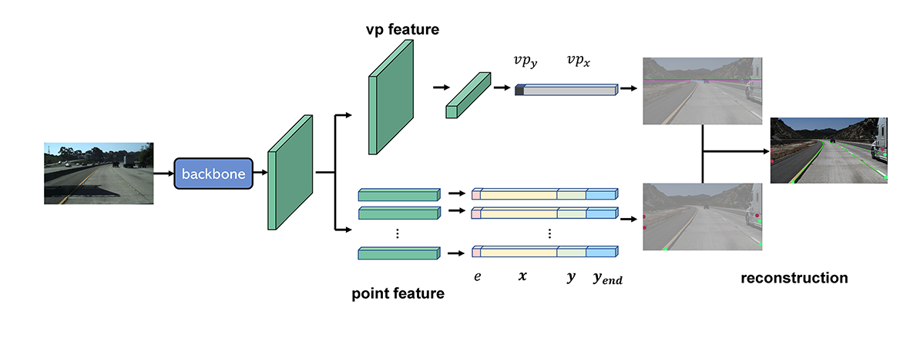
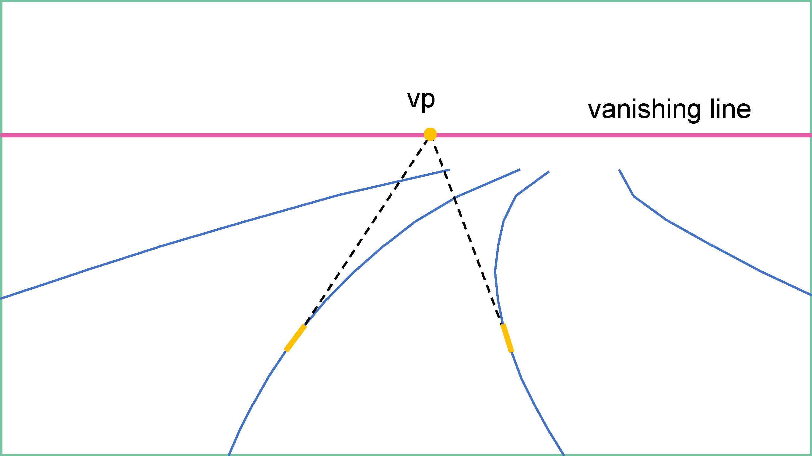
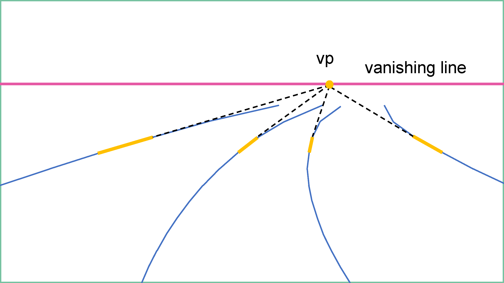

# <center> Local Vanishing Points for Lane Detection </center>

# Introduction
Code for [Local Vanishing Points for Lane Detection]()
<center>

</center>

local vanishing points
<center>


</center>


# Install
-  Clone the project\
  ...
-  Install dependencies
  - Python 3.8
  - PyTorch 1.9.1
  - Cuda 11.1

  ```shell
  pip install -r requirements.txt
  ```

# Dataset
## Download Dataset
download dataset to path (.\dataset\tusimple)

the dataset can be downloaded from [tusimple dataset](https://github.com/TuSimple/tusimple-benchmark/issues/3)\
list6_train.txt, list6_val.txt can be download from [list](https://github.com/cardwing/Codes-for-Lane-Detection/tree/master/ENet-TuSimple-Torch/list6)

## Dataset Directory
```
TuSimple Base Directory (.\dataset\tusimple)
  ├─ train_set (unzipped from train_set.zip)
  │  ├─ clips
  │  └─ ... 
  ├─ test_set (unzipped from test_set.zip)
  │  ├─ clips
  │  └─ ... 
  ├─ lists
  │  ├─ list6_train.txt
  │  └─ list6_val.txt
  ├─ label_data_0313.json
  ├─ label_data_0531.json
  ├─ label_data_0601.json
  ├─ test_label.json
  ├─ train_vp.json (generated by (tools\save_vplabel_tusimple.py))
  └─ val_vp.json (generated by (tools\save_vplabel_tusimple.py))
```

## Generate Vanishing Point Label
```shell
python tools/save_vplabel_tusimple.py
```

# Get Start
## Train
```shell
python train.py --config=config/LVP_TuSimple.yaml
```
## Eval
```shell
python eval.py --config=config/LVP_TuSimple.yaml --checkpoint=your/checkpoint/path
```

if you want to visualize the result of predicted image
```shell
python eval.py --config=config/LVP_TuSimple.yaml --checkpoint=your/checkpoint/path --vis
```

## Speed Test
```shell
python tools/speed_test.py
```

# Result
| Backbone | Acc | FP | FN |
| :---     | ---:|---:|---:|
| [ResNet-18](#)| 95.36 | 12.73 | 4.08 | 

# Reference
- https://github.com/bubbliiiing/unet-pytorch
- https://github.com/voldemortX/pytorch-auto-drive